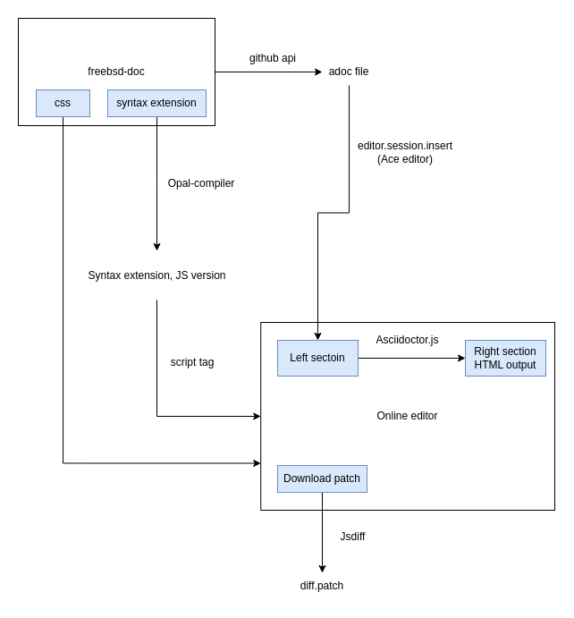

# FreeBSD Online Document Editor

It is an online website editor for FreeBSD documentation which is still developing. The purpose of FreeBSD Online Document Editor is to simplify the editing process in FreeBSD documentation.

This is the workflow of this project.



Online website location: https://wang-yan-hao.github.io/FreeBSD-Online-Document-Editor/root/

## Directory
* freebsd-doc-main: freebsd doc project
* root: website file
* root/config: website setting file
* root/lib: asciidoc syntax extension in freebsd doc project
* root/scripts: JS file

## Installation

node.js >= v16.13.1

npm >= v8.18.0

```bash 
$ cd ./root/

$ npm install 
```

## Package

1. Opal-compiler@1.0.13, installed by npm in root/package.json
2. Asciidoctor.js@2.2.6 , copy the core js file from GitHub in root/scripts/asciidoctor.js
3. Ace.js@1.11.2, using CDN to include in root/index.html
4. Jsdiff@5.1.0, using CDN to include in root/index.html

## Open in the local server

There are three ways to open the website on the local server that can help you develop. When you change the code, you can see the change on the local server immediately.

### 1. VSC extension

You can easily open a local server through the [liver-server](https://github.com/ritwickdey/vscode-live-server-plus-plus) extension.

### 2. Node.js
Use the npm package, "http-server" to open a local server.

```bash
$ npm install --global http-server

$ http-server /root [options]
```

Advanced usage of [http-server](https://www.npmjs.com/package/http-server).

### 3. FreeBSD
We will use apache24 to open the local server.

```
$ pkg install apache24 # install

$ vim /usr/local/etc/apache24/httpd.conf
```
Change "ServerName" column to your ip and 80 port. "DocumentRoot" and "Directory" tag also need to be set to the root directory.

Please refer [Apache document](https://httpd.apache.org/docs/2.4/configuring.html)

```
$ service apache24 configtest # See is there something wrong on the httpd.conf file

$ service apache24 start # start apache service
```

## Contributing

Pull requests are welcome. For major changes, please open an issue first to discuss what you would like to change.

## License

[MIT](https://choosealicense.com/licenses/mit/)
