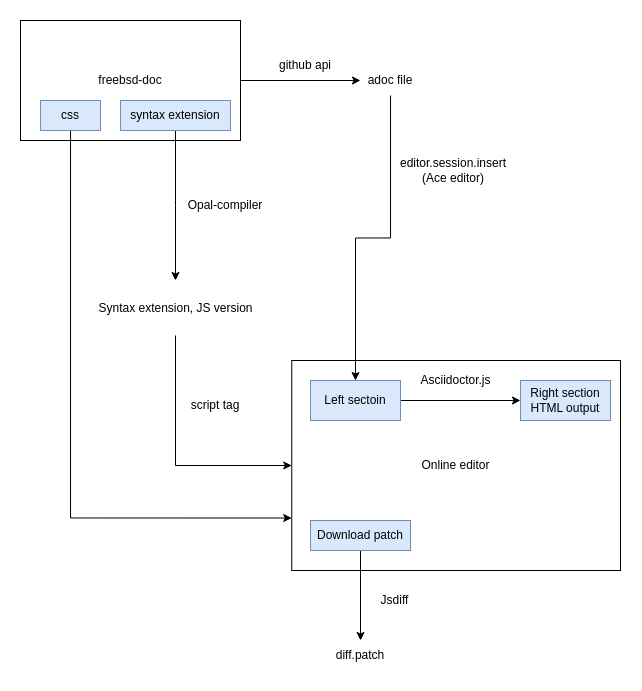

# FreeBSD Online Document Editor
It is an online website editor for FreeBSD documentation which is still developing. The purpose of FreeBSD Online Document Editor is to simplify the editing process in FreeBSD documentation.

Workflow of this project:



We use Github Page to deploy the project, it is considered a pre-release version that will deploy on the production environment (ci.freebsd.org).

* [Online website](https://wang-yan-hao.github.io/FreeBSD-Online-Document-Editor/)
* [Related slide](https://drive.google.com/file/d/1rOQ_-Yzue83arFYGgiYbY9MxbMQg7SC5/view?usp=drive_link)

## Installation
node.js >= v16.13.1
npm >= v8.18.0

```bash 
$ npm install
```

Related commands:
```bash
$ npm run build # Generate production code
$ npm run eslint # Check JavaScript code formatting with ESLint
$ npm run eslint-fix # Automatically format JavaScript code with ESLint
$ npm run prettier # Check HTML and CSS code formatting with Prettier
$ npm run prettier-fix # Automatically format HTML and CSS code with Prettier
```

## Package
1. Opal-compiler@1.0.13: installed by `npm`.
2. Asciidoctor.js@2.2.6: installed by `npm`. This release is based on Asciidoctor 2.0.17 and Opal 0.11.99.dev ([link](https://github.com/asciidoctor/asciidoctor.js/releases)).
3. Ace.js@1.11.2: using the Cloudflare CDN to include.
4. Jsdiff@5.1.0: using the Cloudflare CDN to include.

## Open in the local server
There are three ways to open the website on the local server that can help you develop. When you change the code, you can see the change on the local server immediately.

### 1. VSC extension
You can easily open a local server through the [liver-server](https://github.com/ritwickdey/vscode-live-server-plus-plus) extension.

### 2. Node.js
Use the npm package, "http-server" to open a local server.

```bash
$ npm install --global http-server
$ http-server /root [options]
```
Advanced usage of [http-server](https://www.npmjs.com/package/http-server).

### 3. FreeBSD
We will use apache24 to open the local server.

```
$ pkg install apache24 # Install apache
$ vim /usr/local/etc/apache24/httpd.conf
```
Change the "ServerName" column to your ip and 80 port. The "DocumentRoot" and "Directory" tag also need to be set to the root directory.

```
ServerName www.example.com:80

DocumentRoot "/path-to-project/"
<Directory "/path-to-project/">
  Options Indexes FollowSymLinks
  AllowOverride None
  Require all granted
</Directory>
```

Please refer [Apache document](https://httpd.apache.org/docs/2.4/configuring.html)

```
$ service apache24 configtest # Check for errors in the httpd.conf file
$ service apache24 start # Start the Apache service
```

## Contributing
Pull requests are welcome. For major changes, please open an issue first to discuss what you would like to change.

## License
[MIT](https://choosealicense.com/licenses/mit/)
